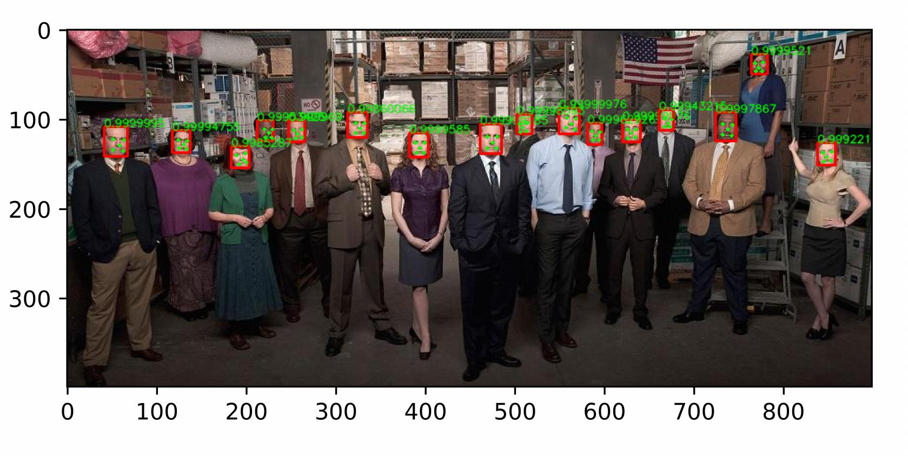

# Overview
The pytorch version of mtcnn supports GPU-accelerated reasoning, modified predecessors' code completion, and aims to simplify the algorithm use process and provide upper-level detection interfaces for easy calling.<br>


# How to use
```python
detector = FaceDetector()
bounding_boxes,scores,landmarks = detector.detect(detectImg)
```
For image and online camera detection, see `test_on_camera.py` and `test_on_images.py` respectively.<br>

## Reference
[MTCNN_face_detection_alignment_pytorch](https://github.com/mayuanjason/MTCNN_face_detection_alignment_pytorch )<br>
[TropComplique/mtcnn-pytorch](https://github.com/TropComplique/mtcnn-pytorch)<br>
[faciallab/FaceDetector](https://github.com/faciallab/FaceDetector)<br>

## Citation
```
@article{7553523,
    author={K. Zhang and Z. Zhang and Z. Li and Y. Qiao}, 
    journal={IEEE Signal Processing Letters}, 
    title={Joint Face Detection and Alignment Using Multitask Cascaded Convolutional Networks}, 
    year={2016}, 
    volume={23}, 
    number={10}, 
    pages={1499-1503}, 
    keywords={Benchmark testing;Computer architecture;Convolution;Detectors;Face;Face detection;Training;Cascaded convolutional neural network (CNN);face alignment;face detection}, 
    doi={10.1109/LSP.2016.2603342}, 
    ISSN={1070-9908}, 
    month={Oct}
}
```