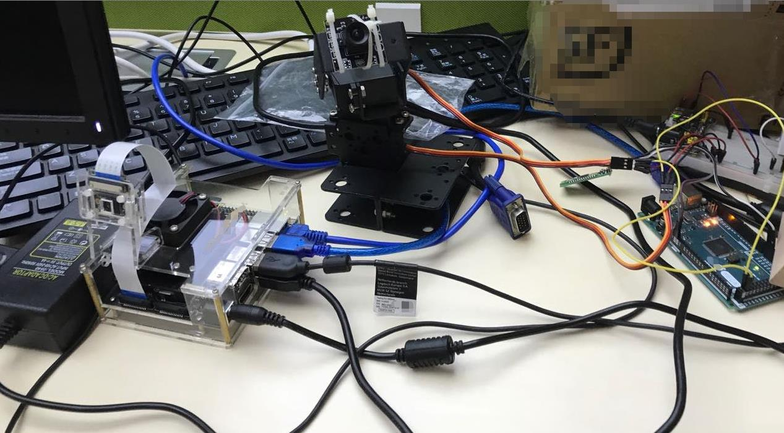
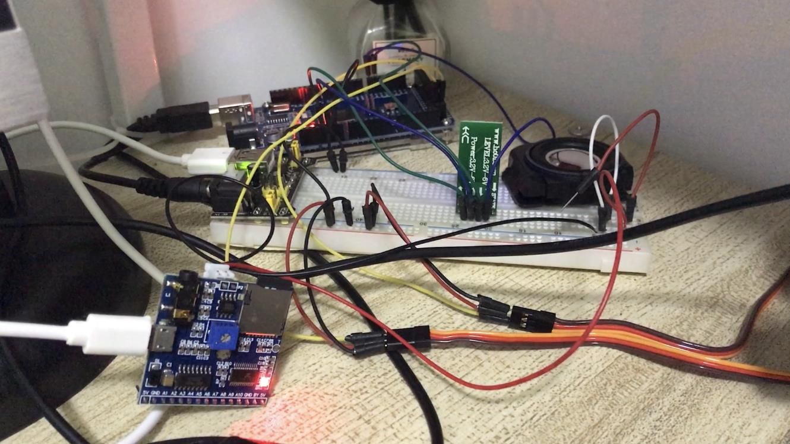

<br>
<br>

## Overview
----
Lightweight face detection and recognition library, which can be recognized in real time on jetson/pc devices. The algorithm uses mature MTCNN/Ultra-Light-Fast-Generic-Face-Detector-1MB face detection+InsightFace(Arcface+cosface head Face recognition with +MobileFacenet, resnet backbone), the recognition range is limited to a closed set range, and the training mode can only be performed after collecting the face of each of us.
This project also adds [Servo tracking face position](./arduinoPro/README.md) function, model quantification (coming soon) + opencv-cuda acceleration + voice recognition broadcast + Bluetooth control.<br>

轻量级的人脸检测和识别库，可在jetson/pc设备上实时识别，算法采用成熟的MTCNN/Ultra-Light-Fast-Generic-Face-Detector-1MB人脸检测+InsightFace(Arcface+cosface head和+MobileFacenet、resnet backbone)进行人脸识别，识别范围限定为闭集范围内，训练模式待收集到我们每个人的人脸后方可进行。
本项目还增加[舵机跟踪人脸位置](./arduinoPro/README.md)功能，opencv-cuda加速+语音识别播报+蓝牙控制。

## software main requirements

### for pc train and inference
- numpy
- pre-build opencv-python or opencv with cuda support
- pytorch
- tensorRT
- pyserial
- pyaudio
- [arduino IDE](https://www.arduino.cc/en/Main/Software )
- matlab2020a+(and [arduino support package](https://ww2.mathworks.cn/matlabcentral/fileexchange/47522-matlab-support-package-for-arduino-hardware?s_tid=srchtitle ))

### for jetson inference
- numpy
- pre-build opencv-python or opencv with cuda support
- pytorch
- tensorRT
- pyserial

## hardware main requirements
- [jetson(nano,tx2,nx,...)](https://www.nvidia.com/en-us/autonomous-machines/jetson-store/ )
- [arduino(nano,mega2560,...)](https://store.arduino.cc/usa/ )
- 2 high precision [digit servo](https://www.amazon.com/ANNIMOS-Digital-Waterproof-DS3218MG-Control/dp/B076CNKQX4 )
- rotating platform(steering gear bracket)
- high fps usb camera or ordinary camera
- HC-08 bluetooth module,[reference product](https://www.amazon.com/DSD-TECH-SH-HC-08-Transceiver-Compatible/dp/B01N4P7T0H ) or [tao bao](https://item.taobao.com/item.htm?spm=a1z09.2.0.0.591b2e8diCFrEx&id=587180917690&_u=s1nargtrf092 )
- serial port voice broadcast module,[reference product](https://www.amazon.com/-/zh/dp/B082GFPLNW/ref=sr_1_1?__mk_zh_CN=%E4%BA%9A%E9%A9%AC%E9%80%8A%E7%BD%91%E7%AB%99&dchild=1&keywords=serial+port+voice+broadcast+module&qid=1603896362&sr=8-1 )or [tao bao](https://detail.tmall.com/item.htm?id=523931134290&spm=a1z09.2.0.0.591b2e8diCFrEx&_u=s1nargtr4d44 )
- arduino voice recording module,[reference product](https://www.amazon.com/-/zh/dp/B00V81XEI0/ref=sr_1_2?__mk_zh_CN=%E4%BA%9A%E9%A9%AC%E9%80%8A%E7%BD%91%E7%AB%99&dchild=1&keywords=arduino+voice+recording+module&qid=1603896437&sr=8-2 ) or [tao bao](https://detail.tmall.com/item.htm?id=14475144954&spm=a1z09.2.0.0.591b2e8diCFrEx&_u=s1nargtrfa04 )
- breadboard
- dupont Line

## datasets

### train datasets （pc上完成）
参考其中项目[InsightFace_Pytorch](https://github.com/TreB1eN/InsightFace_Pytorch )数据集,数据量太大，这里只给出了101人的人脸图像.<br>
[百度网盘](https://pan.baidu.com/s/1A2QPl0SZ_qzMrCDScspwhg )，提取码：nfy3<br>
[google drive](https://drive.google.com/file/d/1gjHF4lZWAnnm2Fe0j8TNBcfer0NwGgI6/view?usp=sharing )<br>
训练数据集目录结构如下，命名无要求。
```
yourTrainDataFolder/
        ---> train_name1/
            ---> id1_1.jpg
			---> ...
        ---> train_name2/
            ---> id2_1.jpg
			---> ...
        ---> train_name3/
            ---> id3_1.jpg
           ---> id3_2.jpg
		   ---> ...
```
### test datasets (pc或者jetson上完成)
在当前项目目录下的文件夹 `./dataSets/facebank/`准备自己需要识别的人脸图像,目录结构也类似上面排布，命名无要求，文件夹名与姓名同名最佳。
```
./dataSets/facebank/
        ---> zhangsan/
            ---> id1_1.jpg
			---> ...
        ---> lisi/
            ---> id2_1.jpg
			---> ...
        ---> wangwu/
            ---> id3_1.jpg
           ---> id3_2.jpg
		   ---> ...
		---> ...
		...
		facebank.pth
		names.npy
```
提供已知的人脸图像还可以使用prepare_getFaces.py摄像头在线采集，图像会自动存储到上述路径。若有多幅图像，则特征取平均值。

## How to recognize face (use camera to inference,for pc and jetson) 
1、准备数据集和模型:数据集为上述`test datasets`自己需要识别已知的人脸图像，模型为`./models/`文件夹下选择适合的;<br>
2、准备人脸数据库：`python prepare_faceDatabase.py`进行人脸数据库特征和姓名存储，会自动生成上述目录结构中的facebank.pth和names.npy；<br>
3、摄像头在线识别：`python camera_faceRec.py`<br>

## How to train your model (for pc)
准备好上述的train datasets，设置好一些arguments，执行`train.py`即可。 

##  models

包含人脸检测和识别模型（IR-SE50，Mobilefacenet），caffemodel,onnx,pth类型.<br>
[百度网盘](https://pan.baidu.com/s/1cusOnp2wrUPR_6UBcQJZqg )，提取码f3v6<br>
[google drive](https://drive.google.com/file/d/1HIN0VHPT6ngLgQmxXBk5e-Jk0AKdU9-i/view?usp=sharing )<br>

## performance
|model | LFW(%) | CFP-FF(%) | CFP-FP(%) | AgeDB-30(%) | calfw(%) | cplfw(%) | vgg2_fp(%) |
|------| ------ | --------- | --------- | ----------- | -------- | -------- | ---------- |
|ir_se50 | 0.9952 | 0.9962    | 0.9504    | 0.9622      | 0.9557   | 0.9107   | 0.9386     |
| mobilenet-face | 0.9918 | 0.9891   | 0.8986    | 0.9347      | 0.9402   | 0.866    | 0.9100     |


[reference statistics](https://github.com/TreB1eN/InsightFace_Pytorch )

## jetson-opencv-cuda编译
[jetson-opencv-cuda编译](./build_opencv.md)

## References 
- Arcface[(paper)](https://arxiv.org/abs/1801.07698 )
- Insightface[(github)](https://github.com/deepinsight/insightface )
- InsightFace_Pytorch[github](https://github.com/TreB1eN/InsightFace_Pytorch )
- [Ultra-Light-Fast-Generic-Face-Detector-1MB](https://github.com/Linzaer/Ultra-Light-Fast-Generic-Face-Detector-1MB )
- 新版本依赖的[MTCNN_Pytorch](https://github.com/mayuanjason/MTCNN_face_detection_alignment_pytorch )
- [onnx转tensorRT-linux](https://github.com/RizhaoCai/PyTorch_ONNX_TensorRT )
- [pytorch quantization](https://pytorch.org/blog/introduction-to-quantization-on-pytorch/ )
- [onnxruntime quantization](https://github.com/microsoft/onnxruntime/tree/v1.0.0/onnxruntime/python/tools/quantization )
- MobileFacenet[(paper)](https://arxiv.org/abs/1804.07573 )
- [jetson_Nano](https://elinux.org/Jetson_Nano )


