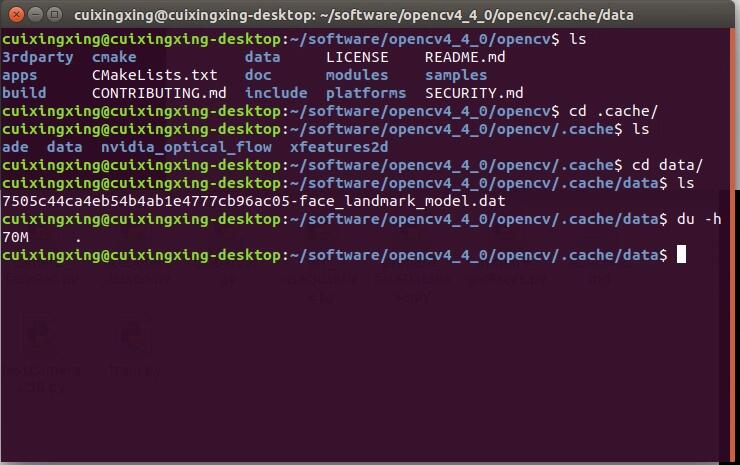
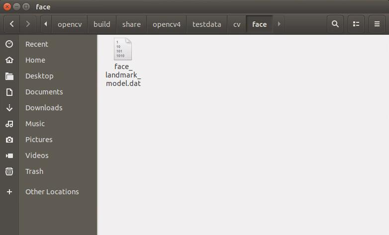
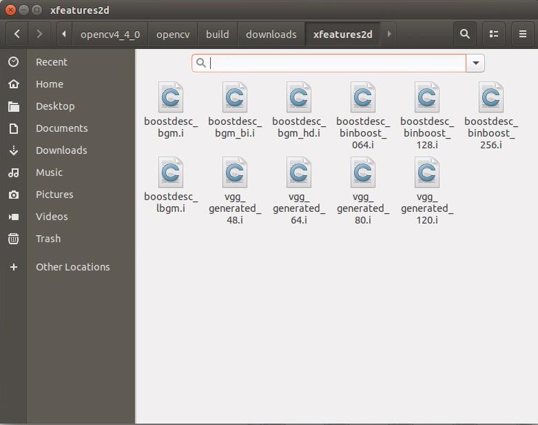
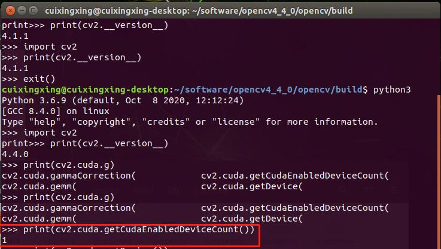
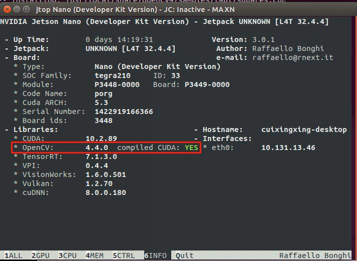
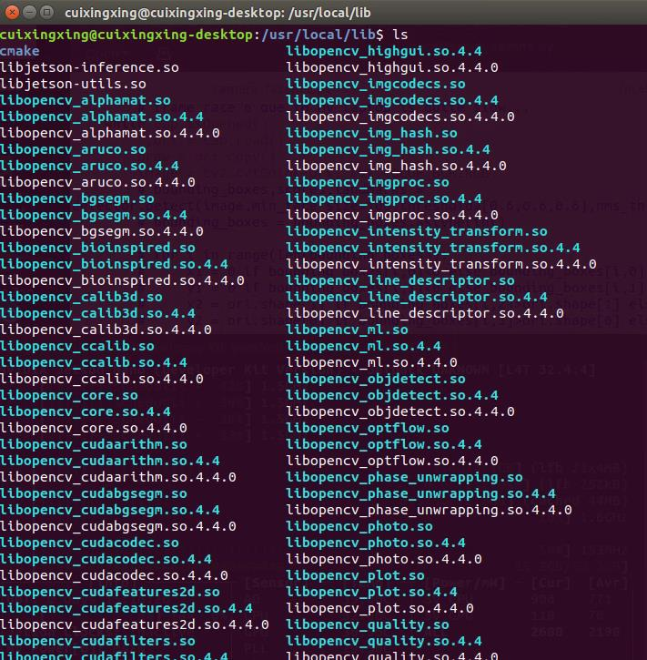

## 编译前工作
安装依赖库：
```bash
sudo apt-get install build-essential
sudo apt-get install libglew-dev libtiff5-dev zlib1g-dev libjpeg-dev libavcodec-dev libavformat-dev libavutil-dev libpostproc-dev libswscale-dev libeigen3-dev libtbb-dev libgtk2.0-dev pkg-config libpng-dev
sudo apt-get install libatlas-base-dev gfortran
sudo apt-get install libgstreamer1.0-dev libgstreamer-plugins-base1.0-dev
```
系统包更新：
```bash
sudo apt update
sudo apt upgrade
```

## 编译
安装官方系统镜像后，jetson-pack会自带opencv，但缺少cuda支持，为了能在板子上利用opencv-cuda加速，需要从源码编译opencv,这里以opencv4.4为示例。

1、官网下载好4.4版本的[opencv](https://github.com/opencv/opencv/releases ) Source code(zip)和对应4.4版本的[opencv-contrib](https://github.com/opencv/opencv_contrib/releases ) Source code(zip)<br>
2、把上面下载好的opencv和opencv-contrib一并拷贝到jetson某个文件目录下并解压。<br>
3、打开终端，输入如下命令；
```bash
cd opencv/
mkdir build/
cd build/
```
重新编译需要删除以前的编译文件：
```bash
rm -rf build/
mkdir build
cd build/
```
接着配置cmake选项,终端输入如下指令：
```
cmake \
    -DCMAKE_BUILD_TYPE=Release \
    -DBUILD_PNG=OFF \
    -DBUILD_TIFF=OFF \
    -DBUILD_TBB=OFF \
    -DBUILD_JPEG=OFF \
    -DBUILD_JASPER=OFF \
    -DBUILD_ZLIB=OFF \
    -DBUILD_EXAMPLES=ON \
    -DBUILD_opencv_java=OFF \
    -DBUILD_opencv_python2=OFF \
    -DBUILD_opencv_python3=ON \
    -DENABLE_PRECOMPILED_HEADERS=OFF \
    -DWITH_OPENCL=OFF \
    -DWITH_OPENMP=OFF \
    -DWITH_FFMPEG=ON \
    -DWITH_GSTREAMER=ON \
    -DWITH_GSTREAMER_0_10=OFF \
    -DWITH_CUDA=ON \
    -DWITH_GTK=ON \
    -DWITH_VTK=OFF \
    -DWITH_TBB=ON \
    -DWITH_1394=OFF \
    -DWITH_OPENEXR=OFF \
    -DCUDA_TOOLKIT_ROOT_DIR=/usr/local/cuda-10.2 \
    -DCUDA_ARCH_BIN="5.3,6.2,7.2" \
    -DCUDA_ARCH_PTX="" \
    -DINSTALL_C_EXAMPLES=ON \
    -DOPENCV_ENABLE_NONFREE=ON 
    -DINSTALL_TESTS=OFF \
    -DOPENCV_EXTRA_MODULES_PATH=../../opencv_contrib/modules \
    .. 
```
注意上面的`DCUDA_TOOLKIT_ROOT_DIR`、`DOPENCV_EXTRA_MODULES_PATH`改成适合自己的路径，`DWITH_GSTREAMER`为`ON`时支持CSI板载摄像头。如果想要把所有模块编译一个大的world库，则应当加上`DBUILD_opencv_world=ON`;如果涉及到非ROOT权限安装，则指定`CMAKE_INSTALL_PREFIX`，比如`DCMAKE_INSTALL_PREFIX=/home/cuixing158/opencv4_4_0`<br>
编译几分钟后，一定注意屏幕出现的信息，重点查看是否有报错，一般情况下会因为国内网络环境影响，都会出错，下载第三方库或者数据下不下来，这里根据我个人情况，给出第三方百度网盘[下载文件](https://pan.baidu.com/s/1NJLbbwxz1ouJigW9j5C-oA ),提取码：jmn7，放到指定文件路径下重新执行上面cmake指令即可，一直到无措为止。<br>
如果`ippicv_2020_lnx_intel64_20191018_general.tgz` 这个文件在编译过程中失败，应当从报错的url链接中重新单独下载此文件，然后把此文件放置在opencv源码目录下的此路径，比如`opencv-x.x.0/.cache/ippicv/MD5-ippicv_2020_lnx_intel64_20191018_general.tgz`，注意这里面的`MD5`是属于你版本的一串数字号码，一般从`opencv-x.x.x/3rdparty/ippicv/ippicv.cmake`中可以找到。<br>

其中指定路径请参考截图<br>
<br>

<br>
最终cmake成功如下<br>
<br>
4、编译安装，终端执行如下：<br>
```bash
sudo make -j6
sudo make install
```
编译时间较长，2-5小时不等，中间最好不要做其他事，以免中途容易异常中断。如果遇到Makefile:160: recipe for target 'all' failed报错，多次尝试上面指令编译即可。<br>

## 测试
编译安装没问题后，直接在终端进入python3环境，查看cuda支持情况：
<br>
另外打开jtop，从信息栏可以看出opencv支持cuda了<br>
<br>
以上编译后，会自动写入到环境，切入到`/usr/local/lib/`可以看到编译好的库：


## 查看opencv编译构建信息
```python
import cv2
print(cv2.getbuildinformation())
```

## Reference:
[How to configure your NVIDIA Jetson Nano for Computer Vision and Deep Learning](https://www.pyimagesearch.com/2020/03/25/how-to-configure-your-nvidia-jetson-nano-for-computer-vision-and-deep-learning/ )<br>
[Jetson nano编译opencv](https://blog.csdn.net/weixin_42640549/article/details/104732567 )<br>
[opencv_makefile:162_issue](https://github.com/opencv/opencv/issues/15398 )<br>
[opencv build “FFMPEG: Download failed”](https://blog.csdn.net/pyt1234567890/article/details/106525475)
